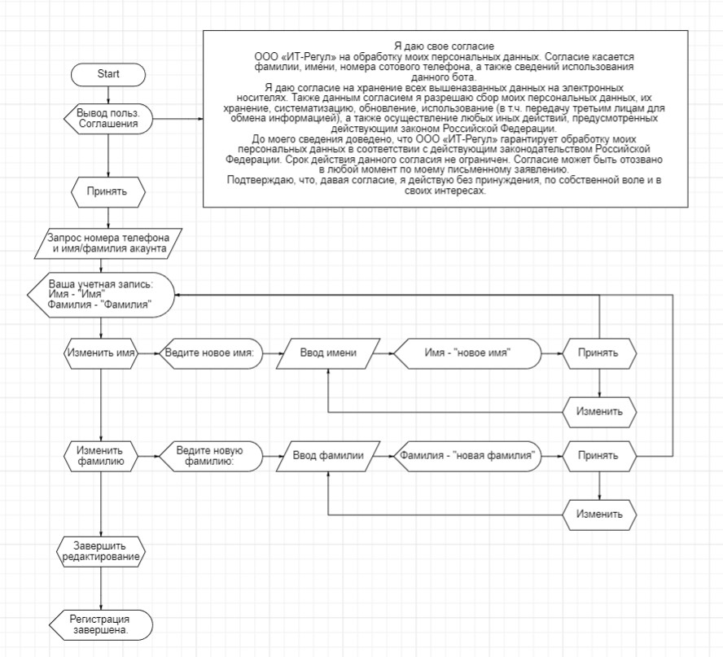

# Тестовое задание для IT-Regul

Телеграмм бот с функцией регистрации. При регистрации добавляется запись в БД с использованием Django
При отправке сообщения боту - зарегистрированному пользователю выводится сообщение, что он зарегистрирован.
Незарегистрированному - предлагается регистрация (Алгоритм регистрации в блок схеме ниже).
Зарегистрироваться можно один раз. 
Регистрация осуществляется по номеру телефона.
Сохраняется идентификатор пользователя.

